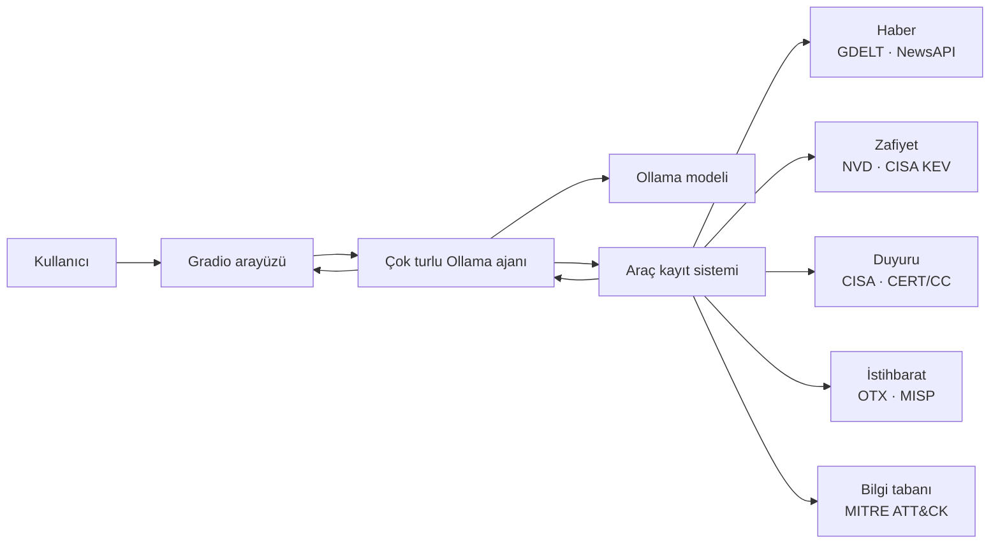

# Siber Güvenlik Haber Asistanı

Ollama üzerinde çalışan yerel bir dil modelinin güncel siber güvenlik kaynaklarını
araç çağrılarıyla sorguladığı Türkçe Gradio uygulaması.

Model; CVE, aktif istismar, güvenlik duyurusu, haber ve tehdit istihbaratı
sorularında uygun veri kaynağını seçer. Arayüz her araç çağrısını, parametrelerini,
sonucunu, tur numarasını ve nihai yanıtı kullanıcıya gösterir.

[Hugging Face Space](https://huggingface.co/spaces/samliumay/CI_Assistani) ·
[Ollama](https://docs.ollama.com/) ·
[Gradio](https://www.gradio.app/)

## Özellikler

- Türkçe sistem promptu ve Türkçe araç tanımları
- Birden fazla tur ve aynı turda paralel araç çağrısı desteği
- Güncel bilgi sorularında otomatik API kullanımı
- Araç adı, parametre, ham sonuç, süre ve model yanıtının görünür olması
- CVSS skoru ile CISA KEV aktif istismar durumunun ayrı değerlendirilmesi
- GDELT için yeniden deneme, geniş zaman aşımı ve beş dakikalık önbellek
- Haber kaynakları çalışmadığında CISA ve CERT/CC duyurularına kontrollü geri dönüş
- API anahtarlarının yalnızca sunucu ortam değişkenlerinden okunması
- Arayüzden 1B, 4B, 9B veya 35B model seçimi
- Temperature, Top-K ve Top-P üretim kontrolleri
- Tüm ajan turlarını kapsayan girdi, çıktı ve toplam token istatistikleri
- Yerel Python, Docker ve Hugging Face Docker Space desteği

## Mimari



Modelin gizli düşünce metni gösterilmez. Yalnızca denetlenebilir eylemler, araç
sonuçları ve kullanıcıya yönelik yanıt arayüzde sunulur.

## Veri kaynakları ve araçlar

| Araç | Kaynak | Amaç |
|---|---|---|
| `siber_haberlerini_ara` | GDELT, NewsAPI | Güncel siber güvenlik haberleri |
| `son_cve_kayitlarini_getir` | NIST NVD | Yakın zamanda yayımlanan CVE kayıtları |
| `cve_detayi_getir` | NVD, CISA KEV, OTX | Tek bir CVE için zenginleştirilmiş analiz |
| `aktif_istismar_edilenleri_ara` | CISA KEV | Aktif istismar edildiği bilinen zafiyetler |
| `guvenlik_duyurularini_getir` | CISA, CERT/CC | Resmî güvenlik duyuruları |
| `tehdit_istihbarati_ara` | AlienVault OTX, MISP | Pulse, kampanya ve kurumsal istihbarat |
| `mitre_attack_tekniklerini_ara` | MITRE ATT&CK TAXII | Enterprise ATT&CK teknikleri |

GDELT, CISA KEV, temel NVD erişimi, CISA RSS, CERT/CC ve MITRE ATT&CK API
anahtarı olmadan kullanılabilir. NewsAPI, OTX, yüksek limitli NVD ve MISP erişimi
isteğe bağlıdır.

## Gereksinimler

- Python 3.11 veya üzeri
- [Ollama](https://docs.ollama.com/) sunucusu
- Araç çağrısını destekleyen bir Ollama modeli
- İnternet erişimi; güncel veri kaynaklarını sorgulamak için gereklidir

Varsayılan model `qwen3.6:latest` modelidir. Yaklaşık 24 GB disk alanı kullanır.
Daha hafif bir geliştirme ortamı için araç destekli daha küçük bir model
`OLLAMA_MODEL` üzerinden seçilebilir.

## Hızlı başlangıç

### 1. Ollama'yı hazırlayın

```bash
ollama serve
```

Başka bir terminalde:

```bash
ollama pull qwen3.6:latest
```

### 2. Python bağımlılıklarını kurun

`uv` ile:

```bash
uv sync
```

Standart `venv` ve `pip` ile:

```bash
python3 -m venv .venv
source .venv/bin/activate
pip install -r requirements.txt
```

### 3. Yapılandırın

Örnek dosyayı kopyalayın:

```bash
cp .env.example .env
```

Uygulama `.env` dosyasını otomatik yüklemez. Değerleri mevcut kabuğa aktarmak
için:

```bash
set -a
source .env
set +a
```

### 4. Uygulamayı çalıştırın

```bash
uv run python app.py
```

veya etkin sanal ortamda:

```bash
python app.py
```

Arayüz varsayılan olarak `http://127.0.0.1:7860` adresinde açılır.

## Örnek kullanım

Kullanıcı:

> Son 7 günde yayımlanan kritik CVE'leri bul ve aktif istismar durumlarını kontrol et.

Beklenen ajan akışı:

```text
[Tur 1]
→ son_cve_kayitlarini_getir(son_gun=7, sonuc_sayisi=...)
← NVD CVE sonuçları

[Tur 2]
→ cve_detayi_getir(cve_id="CVE-...")
← NVD + CISA KEV + isteğe bağlı OTX sonucu

[Tur 3]
→ Türkçe nihai yanıt, tarihler ve kaynak bağlantıları
```

Ajan en fazla altı araç turu çalıştırabilir. Bu sınır hatalı veya sonsuz araç
döngülerini engeller.

## Yapılandırma

### Ollama ve uygulama

| Değişken | Varsayılan | Açıklama |
|---|---:|---|
| `OLLAMA_BASE_URL` | `http://127.0.0.1:11434` | Ollama veya uyumlu güvenli geçit |
| `OLLAMA_MODEL` | `qwen3.6:latest` | Kullanılacak model |
| `OLLAMA_API_KEY` | boş | Kimlik doğrulamalı uzak geçit için Bearer anahtarı |
| `OLLAMA_TIMEOUT_SECONDS` | `300` | Model yanıt zaman aşımı |
| `OLLAMA_NUM_CTX` | `16384` | Model bağlam penceresi |
| `OLLAMA_TEMPERATURE` | `0.2` | Üretim sıcaklığı |
| `OLLAMA_TOP_K` | `20` | Varsayılan Top-K örnekleme sınırı |
| `OLLAMA_TOP_P` | `0.95` | Varsayılan nucleus sampling eşiği |
| `OLLAMA_PULL_TIMEOUT_SECONDS` | `3600` | Arayüzden seçilen modelin indirme sınırı |
| `OLLAMA_KEEP_ALIVE` | `10m` | Modelin bellekte tutulma süresi |
| `GRADIO_SERVER_NAME` | `127.0.0.1` | Gradio dinleme adresi |
| `GRADIO_SERVER_PORT` | `7860` | Gradio portu |

### Harici kaynaklar

| Değişken | Varsayılan | Açıklama |
|---|---:|---|
| `CYBER_API_CONNECT_TIMEOUT` | `20` | Genel API bağlantı zaman aşımı |
| `CYBER_API_READ_TIMEOUT` | `60` | Genel API okuma zaman aşımı |
| `GDELT_CONNECT_TIMEOUT` | `30` | GDELT bağlantı zaman aşımı |
| `GDELT_READ_TIMEOUT` | `75` | GDELT okuma zaman aşımı |
| `CYBER_NEWS_CACHE_SECONDS` | `300` | Aynı haber sorgusunun önbellek süresi |
| `NEWSAPI_KEY` | boş | NewsAPI erişimi |
| `NVD_API_KEY` | boş | Daha yüksek NVD istek limiti |
| `OTX_API_KEY` | boş | AlienVault OTX erişimi |
| `MISP_BASE_URL` | boş | Kurumsal MISP kök adresi |
| `MISP_API_KEY` | boş | MISP erişim anahtarı |
| `MISP_VERIFY_TLS` | `true` | MISP TLS sertifika doğrulaması |

API anahtarlarını `.env`, Dockerfile, commit, issue veya uygulama çıktısına
yazmayın. Bir anahtar yanlışlıkla paylaşılırsa derhâl iptal edip yenisini oluşturun.

## Docker

Image oluşturma:

```bash
docker build -t siber-guvenlik-asistani .
```

Küçük bir modelle CPU üzerinde geliştirme:

```bash
docker run --rm -p 7860:7860 \
  -e OLLAMA_MODEL=qwen3.5:4b \
  siber-guvenlik-asistani
```

NVIDIA Container Toolkit kurulu bir sistemde GPU kullanımı:

```bash
docker run --rm --gpus all -p 7860:7860 \
  -e OLLAMA_MODEL=qwen3.6:latest \
  siber-guvenlik-asistani
```

`start.sh`; Ollama sunucusunu başlatır, eksikse modeli indirir ve Gradio'yu
`0.0.0.0:7860` üzerinde çalıştırır. Ollama portu container dışına açılmaz.
Docker image varsayılan olarak hızlı başlangıç için `qwen3.5:4b` modelini indirir.
Arayüzde seçilen diğer allowlist modelleri ilk kullanımda Ollama üzerinden
otomatik olarak indirilir.

## Hugging Face Docker Space

Docker dağıtım dosyaları bu depoda tutulur; canlı Space ayrı bir Hugging Face Git
deposunda yayınlanır:

[samliumay/CI_Assistani](https://huggingface.co/spaces/samliumay/CI_Assistani)

Space deposundaki README dosyasında Hugging Face metadata başlığı bulunmalıdır:

```yaml
---
title: Siber Güvenlik Haber Asistanı
emoji: 🛡️
sdk: docker
app_port: 7860
short_description: Ollama ile güncel CVE ve siber güvenlik asistanı
---
```

Hassas değerleri Space içindeki **Settings → Variables and secrets** bölümüne
ekleyin. `qwen3.6:latest` gibi büyük modeller için yeterli GPU belleği ve model
indirme süresi planlanmalıdır.

## Proje yapısı

```text
.
├── app.py                         # Gradio arayüzü
├── main.py                        # Alternatif yerel giriş noktası
├── ollama/
│   ├── cyber_security_tools.py    # API istemcileri ve araç şemaları
│   └── ollama_local_model_managment_code.py
│                                     # Çok turlu Ollama ajan döngüsü
├── tests/test_agent.py            # Ağsız birim testleri
├── Dockerfile                     # Ollama + Gradio container
├── start.sh                       # Container başlangıç akışı
├── requirements.txt               # Space/pip bağımlılıkları
└── pyproject.toml                 # Python proje ve geliştirme ayarları
```

## Test ve doğrulama

Birim testleri gerçek API veya Ollama bağlantısı kurmaz:

```bash
python -m unittest discover -s tests -v
```

Sözdizimi ve whitespace kontrolü:

```bash
python -m compileall -q app.py main.py ollama tests
git diff --check
```

Docker image doğrulaması:

```bash
docker build -t siber-guvenlik-asistani .
```

## Sorun giderme

### Ollama sunucusuna ulaşılamıyor

```bash
ollama list
```

Başarısızsa `ollama serve` çalıştırın ve `OLLAMA_BASE_URL` değerini kontrol edin.
Docker içinde bu adres varsayılan olarak `http://127.0.0.1:11434` olmalıdır.

### GDELT yavaş veya HTTP 429 döndürüyor

Uygulama yeniden deneme ve önbellek kullanır. Gerekirse `GDELT_CONNECT_TIMEOUT`,
`GDELT_READ_TIMEOUT` ve `CYBER_NEWS_CACHE_SECONDS` değerlerini artırın. NewsAPI
anahtarı eklemek ikinci bir haber kaynağı sağlar.

### Docker ilk açılışta uzun süre bekliyor

Model image oluşturulurken değil, container ilk çalıştığında indirilir. Büyük
modellerin indirilmesi ve belleğe yüklenmesi birkaç dakika sürebilir.

## Güvenlik ve doğruluk

- Uygulama savunma, haber takibi ve risk analizi amaçlıdır.
- Güncel kaynaklar gecikebilir, oran sınırına ulaşabilir veya geçici hata verebilir.
- CVSS puanı tek başına aktif istismar kanıtı değildir; CISA KEV ayrıca kontrol edilir.
- Modelin sentezlediği bilgiler kritik kararlardan önce özgün CISA, NVD, CERT/CC
  veya üretici duyurusundan doğrulanmalıdır.
- Ollama uzak sunucuda çalışıyorsa TLS ve kimlik doğrulama arkasında tutulmalıdır.

## Katkı

Issue ve pull request açmadan önce:

1. Sır veya model ağırlığı eklemediğinizden emin olun.
2. Birim testlerini çalıştırın.
3. Yeni araç ekliyorsanız Türkçe şema açıklamasını ve hata davranışını belgeleyin.
